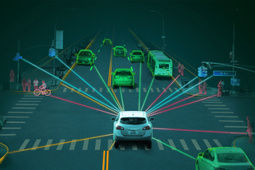
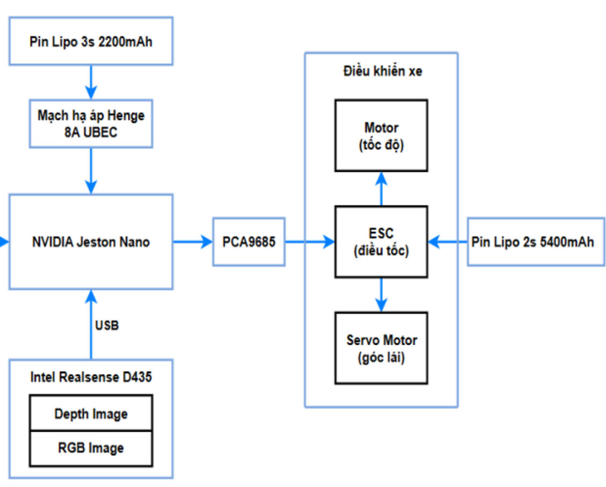
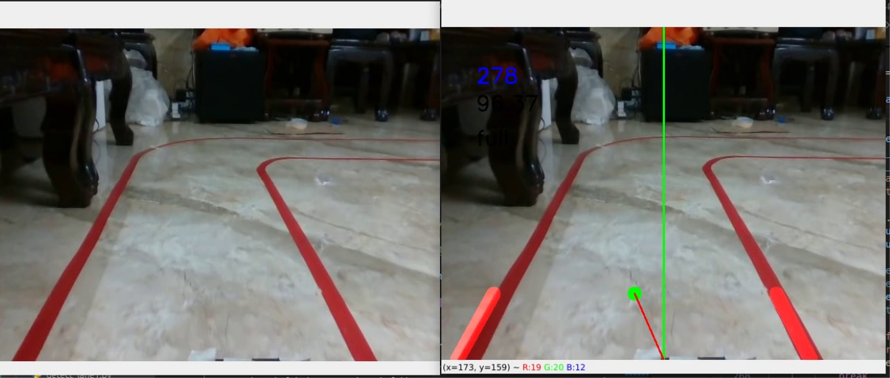
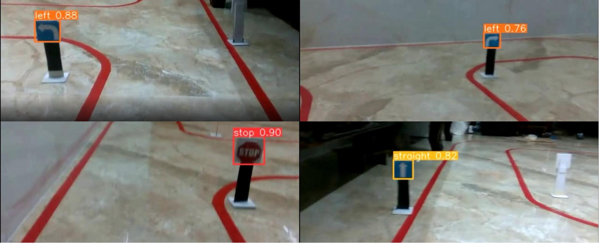

# 🚗 Autonomous Vehicle System Portfolio  

  

This project showcases an **Autonomous Vehicle System** that integrates **image processing** and **deep learning** for lane and traffic sign detection.  

📍 **Live Website:** [🚀 View Portfolio](https://damtuankhoi.github.io/autonomous-vehicle-portfolio/docs/index.html)  

---

## 🌟 Features
✅ **Lane Detection** using OpenCV (Hough Transform)  
✅ **Traffic Sign Recognition** with YOLOv5  
✅ **Real-time Processing** on NVIDIA Jetson Nano  
✅ **Deployed via GitHub Pages**  

---

## 📊 Project Overview  

### 🔍 **1. System Architecture**

The system consists of:  
- **Camera (Intel RealSense D435i)** for real-time video input.  
- **Jetson Nano** for edge AI processing.  
- **Static Web Portfolio** hosted on GitHub Pages.  

### 📸 **2. Lane Detection Example**

Uses **OpenCV (Hough Transform)** to detect lanes in real-time.  

### 🚦 **3. Traffic Sign Recognition**

Utilizes **YOLOv5** trained on a custom dataset for detecting traffic signs with **88.0% mAP@0.5**.  

